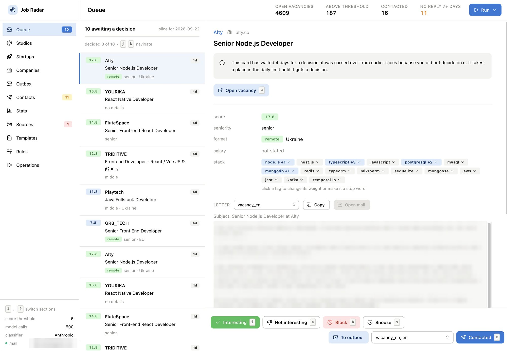
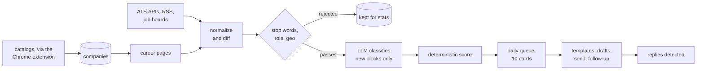

# Job Radar

[](LICENSE)


**A personal job search radar.** Every day it gives you a short list of relevant
vacancies and companies worth writing to, and it remembers who you already wrote to and
who you turned down.

Most job hunting tools optimize for volume. This one does the opposite: at most 10 cards
a day, scored by rules you can read, and letters you write yourself.



It is built for one person: your own database, your own model key, your own mailbox.
There is no sign up and no shared server. You clone it, fill in your own values, and run
it on your laptop or on your own Cloudflare account. Why it is a fork and not a
service: [FORK.md](FORK.md).

## What it does

- **Collects vacancies** from ATS boards (Greenhouse, Lever, Ashby), RemoteOK and RSS
  feeds, DOU and Djinni, Getro networks, HN "Who is hiring", and plain career pages of
  companies that have no ATS.
- **Collects companies** from catalogs: DOU and YC automatically, Clutch, GoodFirms,
  DesignRush, Sortlist and others through a Chrome extension in your own browser (they
  sit behind Cloudflare, and the radar does not bypass that).
- **Filters and scores** deterministically: stop words, role check, geography,
  experience, technology weights. A cheap model (Claude Haiku, or Workers AI) only
  classifies what survives the free filters.
- **Shows a daily queue** of at most 10 cards, because a list of 40 paralyzes. Every
  decision (interesting, not interesting, contacted, block, snooze) is remembered, and
  seen companies do not come back.
- **Separate queues for studios and startups**: agencies you can pitch your services to
  need no vacancy, just a good fit.
- **Outreach**: your own templates, drafts, sending through Gmail or Resend with daily
  limits and warmup, follow-ups, reply detection. The radar never writes letters for you,
  apart from an optional AI first paragraph built from facts you entered yourself.
- **Statistics**: top technologies, median salaries, vacancy lifetime and suspected ghost
  jobs, the funnel from found to replied.
- **Telegram**: one summary on Monday and Thursday, and nothing in between.

## How it works



The expensive step runs last and only on text that changed: pages are normalized (dates,
counters, tokens stripped) and diffed block by block, so a vacancy is classified once.
The model extracts facts as strict JSON; the score itself is plain code you can read and
tune. Vacancies are never deleted, only closed, so they turn into lifetime and ghost job stats.

## How it runs

| mode | good for | database | schedule |
| --- | --- | --- | --- |
| local | trying it out, development | SQLite file in `data/` | `node-cron` inside `pnpm start` |
| Cloudflare | daily use, from the phone, no laptop needed | D1 | Cron Triggers |

The code is the same in both. Hono runs in Node and on Workers, and the Drizzle schema is
shared by SQLite and D1. Deployed, the worker does everything on its own: collects,
scores, sends, reads replies, and messages you. The free Workers plan has a much lower CPU
limit per invocation, which is tight for the scheduled crawls, so Workers Paid is the
safer choice. The model bill is the other cost, see [COSTS.md](COSTS.md).

## Quick start, local

Needs Node 22 and pnpm.

```bash
git clone <this repo> job-radar && cd job-radar
pnpm install
cp .env.example .env     # at least ANTHROPIC_API_KEY and USER_AGENT_CONTACT
pnpm start               # migrations, API on :3000, scheduler
pnpm dev:web             # interface on http://localhost:5173, in another terminal
```

Without `ANTHROPIC_API_KEY` everything works except classification. `USER_AGENT_CONTACT`
is your email: it goes into the User-Agent of every request, so site owners can see who is
visiting. `pnpm cli doctor` tells you what is still missing.

To fill an empty database, open **Operations** in the interface and run the sources, or
from the terminal:

```bash
pnpm cli import:csv imports/seed-companies.csv   # 10 companies with a known ATS
pnpm cli source:sync greenhouse                  # fetch vacancies and classify them
pnpm cli catalog:dou -n 40                       # companies from DOU
pnpm cli discover -n 25                          # career pages for the rest
```

## Deploy to Cloudflare

One command does the whole thing. It is safe to run again, and it reuses whatever
already exists.

```bash
pnpm install
cp .env.example .env     # the keys you have: model, Telegram, mail
pnpm wrangler login
pnpm cf:setup            # add --dry-run to see what it would do first
```

It finds or creates the D1 database `job-radar`, stores its id in `wrangler.local.jsonc`,
applies migrations, builds the frontend and deploys. In the same deploy it uploads as
secrets a generated `RADAR_TOKEN` (the interface password, printed once) and whatever keys
it finds in `.env`, so the worker is never live without a password.

Then:

1. open `https://<your-worker>.workers.dev/?token=<RADAR_TOKEN>`, the browser remembers
   the token after the first visit
2. put the worker URL into `wrangler.local.jsonc` as `WEB_URL` and run `pnpm deploy`, so
   links in Telegram point at it

**Your values stay out of git.** `wrangler.jsonc` is the same for everyone. Anything
personal (database id, the name letters are signed with, AI Gateway, the Gmail callback
URL) goes into `wrangler.local.jsonc`, which is gitignored; `wrangler.local.example.jsonc`
shows what can go there. `pnpm deploy` merges the two into `wrangler.deploy.json` and
deploys that.

**Deploying on every push** (optional): `.github/workflows/deploy.yml` deploys `main`.
Add these in the repository settings, under Secrets and variables, Actions:

| name | kind | value |
| --- | --- | --- |
| `CLOUDFLARE_API_TOKEN` | secret | a token with the "Edit Cloudflare Workers" template |
| `CLOUDFLARE_ACCOUNT_ID` | secret | `pnpm wrangler whoami` |
| `WRANGLER_LOCAL_JSONC` | secret | the whole content of your `wrangler.local.jsonc` |
| `WEB_URL` | variable | your worker URL, for the post-deploy schema check |

The Cloudflare token is a new one from the dashboard, not the Workers AI token in `.env`:
that one cannot deploy. CI does not run migrations on purpose; after a schema change run
`pnpm cf:migrate` from your laptop.

Mail on the worker (Gmail or Resend), Telegram commands, AI Gateway, Workers AI and common
errors: [DEPLOY.md](DEPLOY.md).

## Make it yours

The default rules target remote TypeScript and React roles, with Kyiv as the home city
for the location check. Change them before trusting the queue.

1. **Rules** page: threshold, stop words, technology weights, the role check. Saved in the
   database, so it works on the worker too. The file defaults live in
   `config/scoring.json` (geography, experience, company size); after editing it run
   `pnpm cli score:recalc`.
2. **Templates** page: your own letters for vacancies, studios and startups, your
   signature, and the facts about you (what you have done, in your own words) that the
   optional AI first paragraph of a letter is built from.
3. `.env` (local) or `wrangler.local.jsonc` (worker): `GMAIL_FROM_NAME`,
   `USER_AGENT_CONTACT` and the rest of your identity.

## Daily use

1. **Queue**: today's vacancies. Decide each card: Interesting, Not interesting,
   Contacted (pick the template), Block the company, Snooze for 30 days.
2. **Studios** and **Startups**: companies to pitch to, with a "why this score" breakdown.
3. **Sending**: drafts ready to go, follow-ups that are due, and the daily limit.
4. **Outreach**: who you wrote to, when, and whether they replied.
5. **Sources** and **Operations**: the state of every adapter (red when it returned zero
   where it used to find more) and buttons for running anything by hand.
6. **Stats**: the market picture from what the radar has seen.

## Chrome extension

`extension/` collects companies from catalogs you browse yourself. Load it through
`chrome://extensions`, developer mode, "Load unpacked", the `extension` folder. The popup
asks for your radar address (`http://localhost:3000` or your worker) and the token before
it collects anything. It can also walk pagination on its own, at a human pace: 4 to 9 seconds
between pages and 25 pages per pass by default, never faster than 3 seconds or more than
50 pages. Details: [extension/README.md](extension/README.md).

## Documentation

| file | what is in it |
| --- | --- |
| [DEPLOY.md](DEPLOY.md) | the worker in depth: secrets, AI Gateway, migrations, errors |
| [OUTREACH.md](OUTREACH.md) | sending: providers, limits, warmup, follow-ups, replies |
| [COSTS.md](COSTS.md) | what the model costs and how the spend is kept down |
| [FORK.md](FORK.md) | why fork rather than host, and what is still open |
| [STATUS.md](STATUS.md) | development log and decisions |
| [CLAUDE.md](CLAUDE.md) | project rules, used by Claude Code when working on the repo |

## Commands

| Command | What it does |
| --- | --- |
| `pnpm start` | API and scheduler in one process |
| `pnpm dev` | the same, restarting on changes |
| `pnpm dev:web` | interface on `localhost:5173`, `/api` proxies to 3000 |
| `pnpm cf:setup` | create or reuse everything on Cloudflare and deploy |
| `pnpm deploy` | build and deploy the worker |
| `pnpm cf:migrate` | apply migrations to D1 |
| `pnpm cf:tail` | live worker logs |
| `pnpm test` | tests |
| `pnpm typecheck` | type checking |
| `pnpm db:generate` | generate a migration after changing `src/db/schema.ts` |
| `pnpm db:migrate` | apply migrations locally |

### CLI

Most of these are also buttons on the Operations page.

| Command | What it does |
| --- | --- |
| `pnpm cli db:stats` | how many records are in each table |
| `pnpm cli sources:list` | list of adapters |
| `pnpm cli source:run <id>` | run an adapter and show what it found, without writing |
| `pnpm cli source:sync <id>` | fetch, classify and save (`--skip-llm`, `--no-detail`) |
| `pnpm cli companies:add <domain>` | add a company (`--ats`, `--slug`) |
| `pnpm cli import:csv <files...>` | import companies from a CSV |
| `pnpm cli import:clutch <files...>` | import saved Clutch or TechBehemoths pages |
| `pnpm cli bookmarklet` | bookmarklet code that collects a catalog straight from the open page |
| `pnpm cli catalog:dou` | collect companies from DOU (`--business`, `--domains`, `-n`) |
| `pnpm cli discover` | find career pages and stack (`--domain`, `--all`) |
| `pnpm cli classify:pending` | catch up classification on vacancies missing it |
| `pnpm cli queue` | today's vacancy queue |
| `pnpm cli studios` | queue of studios and agencies (`--min`, `--country`, `-q`, `--all`) |
| `pnpm cli score:explain <vacancy\|company> <id>` | breakdown of the score by points |
| `pnpm cli score:recalc` | recalculate after changing `config/scoring.json` |
| `pnpm cli stats` | top technologies, salary ranges, lifetime, funnel |
| `pnpm cli page:normalize <file or URL>` | what remains of a page after cleanup |
| `pnpm cli page:check <domain> [url]` | snapshot of a career page and a diff against the previous one |
| `pnpm cli notify:check` | check the Telegram connection and show the chat_id |
| `pnpm cli notify <kind>` | `summary`, `digest`, `highscore`, `followups`, `broken`, `test` (`--dry`) |
| `pnpm cli llm:budget` | how many model calls are left for today |
| `pnpm cli runs:last` | latest adapter runs |

## Vacancy sources

| id | what it is | needs a slug |
| --- | --- | --- |
| `greenhouse` | `boards-api.greenhouse.io`, JSON | yes |
| `lever` | `api.lever.co`, JSON | yes |
| `ashby` | `api.ashbyhq.com/posting-api`, JSON | yes |
| `remoteok` | `remoteok.com/api`, JSON (their RSS returns 410) | no |
| `rss:weworkremotely` | Front-End Programming feed | no |
| `rss:himalayas` | general vacancy feed | no |
| `rss:remotive` | general vacancy feed | no |

## Company catalogs

| source | mode | why |
| --- | --- | --- |
| DOU | automatic, `catalog:dou` | open HTML, `robots.txt` allows it |
| Clutch | manual import of saved pages | Cloudflare with bot detection |
| TechBehemoths | browser collector | serves a Cloudflare challenge even on `robots.txt` |
| GoodFirms, DesignRush, Sortlist, The Manifest, UpCity | browser collector | same thing, 403 on any request |
| Awwwards | automatic, `catalog:run awwwards` | only the directory and profiles, which `robots.txt` allows |
| Wadline | not yet | data is rendered client-side, no company domain in the HTML |

DOU shows 20 companies per page, and the "more" button is a POST with a CSRF token.
Instead of simulating a session, we go around it via combinations of filters
(`business` and `domain`). Domain, size and city sit on the company page, so the
second step walks profiles with a one-second pause.

Clutch hides the domain in the `u` parameter of the `r.clutch.co` redirect. If no
cards were recognized in a file, that is an error in the report, not a silent zero.

## Change detection

- **ATS** sources give stable `external_id`s, so appearance and closure are counted by
  comparing sets of ids (`diffByExternalId`). No need to hash the text.
- **Own career pages** go through normalization (`pipeline/normalize.ts`), a block diff
  (`pipeline/diff.ts`) and a snapshot write (`pipeline/snapshots.ts`), no more than five
  per company.

Fixtures for the diff: `fixtures/careers/acme-v1.html`, `acme-v1-noise.html` (the same
set of vacancies, different dates, counters, build hashes), `acme-v2.html` (minus one,
plus one). The test requires that the noisy version produce the same hash.

## Scoring configuration

All lists and weights live in `config/scoring.json`, no need to touch the code. The
file is re-read on the fly (no more often than every 5 seconds), and after editing it
you need to recalculate the scores:

```bash
pnpm cli score:recalc                  # recalculate everything with the new rules
pnpm cli score:explain vacancy 123     # why exactly this score
pnpm cli score:explain company 45
```

What is configurable there:

| section | why |
| --- | --- |
| `roleGate` | the vacancy title has to be an engineering one. Without this, "Sr. Manager, Accounting" scores points from the company description text where React and Next.js are mentioned |
| `geo` | Kyiv, relocation is not possible. "Remote (US)", "San Francisco, hybrid" and any location naming a place with no sign of being remote gets filtered out, no matter what the remote flag says |
| `experience` | 5+ years is -4, 7+ is -8, a lead title is separate |
| `stopWords` | technologies and fields that are not needed |
| `weights` | weights for technologies. The title weighs three times as much, points from the text are capped at `bodyCap` |
| `companies` | scoring for studios: size, services, site stack, country, rate |

## Classification and scoring

1. Stop words on the block's short text, before any network call
2. Loading the full vacancy page, if the block is shorter than 400 characters
3. Stop words again on the full text
4. LLM (`claude-haiku-4-5-20251001`), strict JSON, Zod, one retry, then `needs_review`
5. Deterministic scoring in code, `score = sum of weights + llm_relevance / 20`

Cache in `llm_cache` keyed by the hash of the text that went into the model. Daily
ceiling in `LLM_DAILY_CALL_LIMIT`, counter in `llm_usage`. Everything below
`SCORE_THRESHOLD` stays in the database, it just is not shown in the queue.
Vacancies are never deleted, closed ones get `closed_at`.

## Telegram and schedule

Telegram is only for alerts and reminders, there is no state management there on
purpose.

| when | what |
| --- | --- |
| every 6 hours | ATS and RSS, catch-up classification |
| Monday 04:00 | DOU catalog |
| Tuesday 05:00 | career page discovery |
| Mon and Thu 10:00 | one Telegram digest: queue, finds with score 12+, drafts, follow-ups, broken sources |

The bot cannot message first: you have to open a chat with it and press Start first,
otherwise Telegram returns `chat not found`. Check with: `pnpm cli notify:check`.

Bot commands (read only, actions happen in the web app): `/help` describes the whole
system, `/status` what is in the database right now, `/queue` top cards,
`/followups` who is due for a reminder. Polling is switched off with the
`TELEGRAM_BOT=off` variable.

If `pnpm start` says `EADDRINUSE`, an old process is still running somewhere:

```bash
lsof -nP -iTCP:3000 -sTCP:LISTEN     # see who
kill $(lsof -t -iTCP:3000 -sTCP:LISTEN)
API_PORT=3001 pnpm start             # or just a different port
```

## When something stops working

The first thing to check is whether the database has fallen behind the code:

```
http://localhost:3000/api/health?deep=1
```

A `migrations.behind` field above zero means the code is newer than the schema, and
pages will fail at the first new column. Fixed by `pnpm db:migrate` locally or
`pnpm cf:migrate` on the worker. `pnpm start` and `pnpm dev:api` apply migrations
themselves, so falling behind mostly happens on the deployed instance.

## License

MIT, see [LICENSE](LICENSE).
